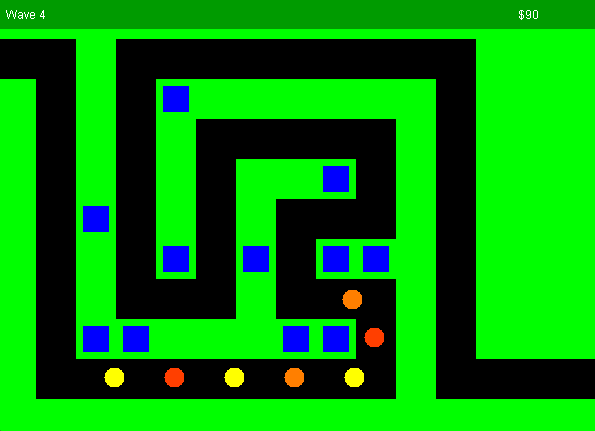

# My Personal Project
## Tower Defense Game (TDGame)

This project and the below writeup was created for the CPSC210 course at UBC.

### Overview
This application is a tower defense game. There is a path across the screen that
enemies make their way towards the end of. If the enemy makes it to the end, the
player loses, so they need to place towers along the path that shoot the enemies
before they make it to the end.

### Who is it for?
This project is meant to be a game that can be played by anyone for fun.

A few examples of people who would enjoy this game:
- A university student who is procrastinating an assignment
- Someone who enjoys playing tower defense games
- Me... hopefully

### Why does it interest me?
Game dev is how I got into programming, and it has always interested me, 
even though I stopped doing it as much. So I thought creating a game
would be a fun chance to try it again. I used to play a tower defense 
game when I was younger, and it would be really cool to recreate something
similar.

## User Stories
- ~~As a user, I want to be able to add a new tower to the map~~
- As a user, I want to be able to see all the towers I have placed on
  the map, and know when they attack an enemy
- As a user, I want to know what wave of enemies I am currently facing
- As a user, I want the game to get harder as time goes on
- As a user, I want to make money to buy new towers every time one of my towers
  destroys an enemy

- ~~As a user, I want to be able save the current state of my game in a file~~
- ~~As a user, I want to be able to load in the saved state of the game from file~~

- As a user, I want to be prompted to save the current state of the game when I close the window
- As a user, I want to be prompted to load in my previous save file when I first open the game
- As a user, I want to be able to click on the map to place a tower if I have enough money to buy the tower
- As a user, I want to be able to right click a tower to remove it and get refunded
- As a user, I want to be able to middle click on a tower to upgrade it - if I have enough money

### Phase 4: Task 2
Thu Mar 31 09:12:56 PDT 2022
Tower added at (X:2, Y:3)
Thu Mar 31 09:12:57 PDT 2022
Tower added at (X:4, Y:6)
Thu Mar 31 09:12:58 PDT 2022
Tower added at (X:8, Y:4)
Thu Mar 31 09:12:59 PDT 2022
Tower removed at (X:2, Y:3)
Thu Mar 31 09:13:00 PDT 2022
Tower added at (X:5, Y:2)

### Phase 4: Task 3

After drawing the UML class design diagram, I noticed 2 major issues with my current design that make the entire diagram
more complex than it needs to be.

After just drawing class relationships, the design seems fairly good. However, after adding the dependencies,
it is clear that my program suffers with low cohesion.

- Saveable and JsonReader/JsonWriter: Since many of the classes in the model interface Saveable, this creates many 
    interface relationships. And since the JsonReader and JsonWriter depend on all of the Saveable classes, it creates
    many dependencies. The way to fix this would have been to do more with the Saveable interface. If it where an 
    abstract class that had functions for saving and loading, the JsonReader and JsonWriter classes would have
    only needed to deal with the Saveable class

- SwingGame: SwingGame is responsible for rendering everything onto the screen. However, since every type of drawn
    has very slight differences in the way it is rendered, SwingGame depends on every class it has to render and
    needs to do a lot of different things, creating low cohesion. The fix for this is simple, since all of the drawing
    has quite similar behavior, creating a Sprite class that every drawn object extends would have meant that every
    type of rendered class (Tower, Enemy, etc), could extend that class and implement its own functionality. Then
    SwingGame would only have to deal with 1 class - the Sprite class

  - TDGame: This class ended up doing much more than I initially wanted it to, meaning it has low cohesion. A fix for this
      would be to seperate some of its functionality (i.e, placing/removing/upgrading towers and handling enemy/bullet
      collision) into seperate helper functions or abstracting them into other classes.
  

- Finally, with the current implementation, it is not very possible to add different types of towers or enemies.
    The fix for this would be add abstract classes for each, and then create specilized tower and enemy classes
    that extend the base functionality.

Just the 4 fixes above would fix most of the cohesion and coupling issues that the current program faces.

